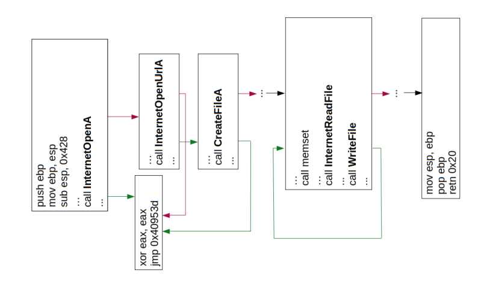
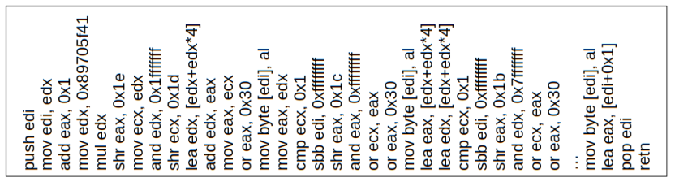
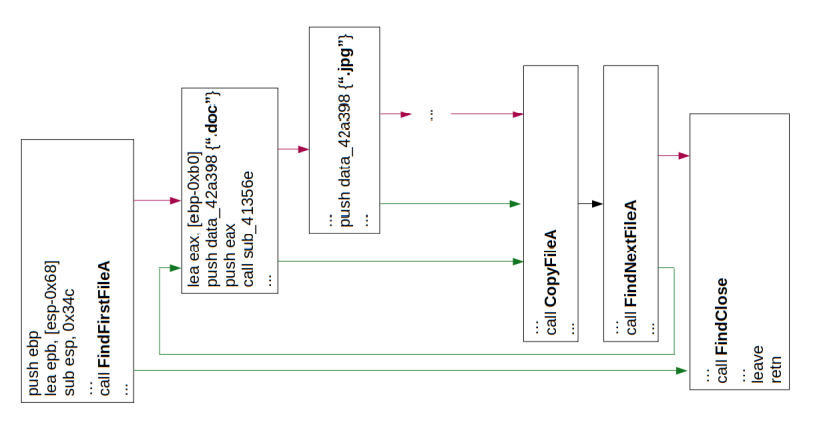
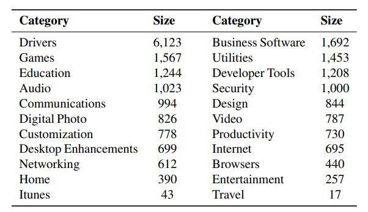
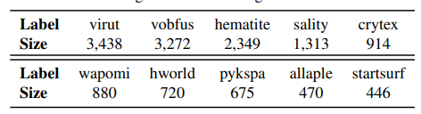

# DeepReflect: 通过二进制重构发现恶意的功能

[TOC]

## 摘要

提出问题：基于二进制逆向工程的恶意软件检测问题，使用机器学习中的监督学习开销较大（需要较大的标记数据集）

解决问题：为了解决效率问题，提出`DeepReflect`

下定义：`localizing定位`&`identifying`&`binary`

使用方法：`unsuper-vised deep neural network`非超级深度神经网络  +`semi-supervised cluster analysis`半监督聚类分析实现组件分类（`incrementally provide labels`逐步提供标签=》不需要进行标记数据集进行训练分类模型）

结果：26k的样本，减少了大约85%的工作，成功检测出80%的恶意软件，与`autoencoder`使用效果比`SHAP`效果更好，因为SHAP也需要标记数据集。

## 背景介绍

​	恶意软件静态逆向工程`manual` &`tedious乏味的`，但是公司收到的样本很多，面对这一现象，只能进行分流。

​	现状：使用检测引擎之后，依旧需要人工进行静态逆向工程（因为不断产生的未分析过的恶意软件样本或者没有新签名来识别样本又或者一些样本不能正常运行）

​	当前解决方法：为样本进行创建签名，分类，聚类

缺陷：只能预测已知样本的类型，而不能具体定位到样本的恶意行为（需要人为进行改善----静态逆向工程-----已经有相关报告表示从业人员因为工作量大而产生消极情绪）

------

​	咨询之后（恶意软件分析师），得出需求

- 识别出恶意函数所在位置并且可以进行标记

  开发出工具的难点在于

  - 识别良性与恶意行为===》》》因为两者之间高度一致，非常具有挑战性
  - 了解识别出的恶意行为的语义===》》》没有进行单独进行函数标记的公开数据集

为了解决需求，开发出`DeepReflect`进行定位并且在使用很少标签数据的情况下进行识别函数的分类。

## 具体情况

### 在二进制文件中对恶意软件组件进行定位

​	使用[AutoEncoder (AE)]()，基于神经网络的机器学习模型---将输入信息重建为自己的输出信息。在训练中学习相关概念，使用**重构错误**信息进行**恶意行为识别**，**无监督**学习模型。

### 对定位到的恶意软件组件进行分类	

​	对识别的函数进行聚类并且使用分析师的注释作为标签，进行恶意软件组件的分类，**半监督**学习模型，只需要每个聚类提供几个标记（整个聚类就会有很多标记）====》》可以预测出已识别函数的类别

### 评估

1. 识别恶意软件中的恶意活动
2. 对相关恶意软件组件进行聚类
3. 提升分析师的工作效率
4. 揭示不同恶意软件类别的相同行为的见解
5. 处理涉及混淆的对抗攻击

### 总结

​	功能：进行定位识别静态恶意软件样本的恶意行为，洞察不同恶意软件家族之间的联系

​	模型：使用不需要标记任何样本的无监督模型进行训练以提高效率；使用利用分析师日产工作中的注释作为标记的半监督模型进行分类恶意软件组件

​	使用AE解释框架进行恶意软件组件的定位

## 例子

### 假设场景

分析师Molly的日常工作流程

1. 搜索以前的类似样本
2. 进入自定义的沙盒概览样本的动态行为
3. 使用逆向工程进行分析

缺陷：繁琐且效率低下。

### 解决方法

​	使用可以进行恶意软件二进制中的函数定位并且描述这些函数的行为的DeepReflect，解决了人工检测的混淆和隐藏问题（通过对比控制流程和API调用尝试去识别相同的行为）

### `Threat Model`

前提：使用静态样本分析（动态检测在概念上可以被扩展，但没有试过），使用之前被研究过的方法去解压样本===》》可靠的拆解，先前已有研究提到过怎样去准确拆解（Dennis Andriesse, Asia Slowinska, and Herbert Bos. Compiler-Agnostic Function Detection in Binaries. In IEEE European Symposium on Security and Privacy, 2017.）

### 研究目标	

​	主要分为以下四个目标：

- 准确识别恶意软件样本中的恶意活动
- 帮助分析师在做静态恶意软件样本分析时集中注意力（提供便捷）
- 识别未出现过的恶意软件类别
- 给出有关描述恶意软件类别之间的联系和其趋势

## 模型`DeepReflect`设计

### 概述

​	目标：识别二进制恶意软件的恶意函数，实际上识别出所有相像的恶意函数通过定位ROI（兴趣区）====》》》ROI检测（使用`AE`)&ROI注解（使用聚类所有ROI的函数并且标记这些聚类）

​	术语：（定义恶意行为），基于识别恶意软件源代码的核心组件生成基础事实（通过MITRE ATT&CK框架实现===》》实现标准化），但是有些观察到的低级函数不能明确的归属到这些高级的描述，只能使用模糊标签进行标识。因此将恶意行为表示为函数。

​	ROI Detection:只检测C&C逻辑位置，并不检测逻辑的具体组件。可以快速为分析师指出登录和进行恶意行为的区域。（先前的研究大多关注创建特设签名来进行恶意软件和或者一些仅调用API的函数）	

​		

​	ROI Annotation：自动标识ROI函数的行为（识别恶意函数做了啥）分析师进行标记聚类符合长尾效应（很小的工作量但相当重要达到很大的效益）--->>>便于在得到具有相似逻辑的恶意软件的具体识别

### ROI Detection

​	使用En(x)编码输入and De(e)进行重构输入，达到目标
$$
De(En(x)) =x
$$
神经网络M将会自动总结	
$$
x ∈ X  where X ⊂Rm
$$
分布，已有实例表明AE会在良性分布中训练中检测到恶意行为（因为如果M无法重构x的特征，将会自动回调恶意概念/模式）

​	给定样本重构向量`M(x) = x-`,恶意样本通过计算均方根误差`MSE`并检测结果是否高于给定阈值φ
$$
MSE= \frac1 m\sum{({x}^{(i)}-{\bar{x}}^{(i)})}^{2}
$$
 基于良性二进制文件与恶意文件相比会有相似但是独特的函数，在良性数据集上进行训练，识别出了每个样本的恶意区域，并且计算出局部MSE：
$$
LMSE= \frac1 m\sum{({x}^{(i)}-{\bar{x}}^{(i)})}^{2}
$$
​	使用阈值去识别未被M识别或者理解的，其中平方根误差超过阈值的区域就是ROI（regions of interest），并将其标记为R数据集
$$
{R}_{x}=\left\{{{({x}^{(i)}-{\bar{x}}^{(i)})}^{2}≥φ}\right\}
$$
​	使用R数据集与使用监督分类模型的SHAP比较类似

#### 特征

​	对于二进制样本下的定位恶意行为的M（神经网络），需要进行1-1的映射回原来的样本，因此捕获了首个m基本块儿的c特征（总结每一项活动）`m-by-c`阶矩阵来代表每个二进制文件

​	*基本块*，是指以指令控制权为终点的一系列指令，可能会因为反汇编程序不同，得到结果不同。

​	*c特征*是从以前的研究中提取出来的，也叫`ACFG（attributed control flow graph）`特征，来表现二进制文件的相似性，找到一些可以用来使目标达到一致性的特征，将其提取出来作为学习恶意软件，将其作用在AE进行捕获高级恶意行为。

​	因此，特征主要包含了每个基本块的指令类型，CFG的结构特征，调用API的类别。

​	设置：m=20k（现有数据集样本中基本块一般少于20k），c=18

假定这些特征是更适合于恶意软件而不是经典的ACFG特征因为：

- 恶意软件包含了先前恶意软件检测时用到的API调用
- 指令类别更加细化，允许更多的内容进入每个人基本块儿
- 不再依赖于太容易受到躲避攻击的字符串

##### 结构特征

​	使用每个基本块儿的`the number of offspring and betweenness score`（子代和间性分）作为结构特征。

​	其中这些列别代表了一系列用于网络交流和文件加密的操作

恶意软件例子：

其中红色代表恶意软件的恶意请求

##### 算术操作

​	使用与每个基本块儿联系的大量的基础数学，逻辑运算，位转换指令，来说明高级行为是怎样用算术操作实现的

恶意软件例子：

使用数据位运算进行曲模糊化和解码进行隐藏恶意软件交互和获取的数据

##### 转移操作

​	使用基本块的栈操作，寄存器操作和端口操作的指令，用来说明高级行为的转移操作是怎样展开的（比如变量增氧提供给函数，以及函数调用之后的返回值放在了哪里），对于复杂逻辑和数据操作有着指示性的作用（使用intel提供的数学模型尽心建模）

##### API调用类别

​	使用基本块儿的相关的API作为API调用类别特征，可以用来说明执行恶意行为所需要的高级库操作，对于理解一个函数的全部行为非常必要

恶意软件例子

搜索特定文件格式，然后将文件复制到特定区域，为更多像数据提取的恶意行为提供条件。

​	

#### 模型

​	为了训练M模型，从大量的良性二进制文件（使用`m-by-c`阶容器表示）创建训练数据集。为了保证AE的模型架构，使用`U-Net`，因为其在生成性图像任务中性能较好，好处是可以跳过编码和解码之间的联系使M可以跳过压缩特定特征去保留**更高的保真度**。

​	计算最小化重构损失，损失计算公式为：
$$
{\ell }_{2}(x,\bar{x})=\sum  {{(x-\bar{x})}^{2}}
$$

###  ROI Annotation

使用一些函数进行注释，然后利用聚类分析传播结果

#### 聚类特征

​	`x`作为一系列解压的恶意软件中提取的二进制文件特征，`F`作为x中使用`BinaryNinja`函数集,并标记F中的每个向量，创建训练集D用来作聚类分析（将所有的F向量转换至D中）
$$
{f}_{i}=\frac 1 {|{q}_{i}|}\sum{q}_{i}，{f}_{i}代表F中的向量
$$
将其添加至D中，并将其应用到所有的恶意软件收集，并且通过实验发现使用F向量的ROI因为使用了聚类的缘故，可以很好的捕获到函数的行为。

#### 聚类模型

​	为了对D中的函数进行聚类，将维数从18维降至5维，以便于将规模扩大至500K，基于PCA进行维数的降低。

​	接着使用`HDBSCAN`进行聚类，并将聚类的D数据集标记为C，使用`HDBSCAN`的好处是可以识别非凸面聚类（与K-means不同），可以自动选择聚类密度的最优参数（经典的DBSCAN没有这个功能）

### DeepReflect部署

#### 初始化

​	解压缩良性和恶意软件的二进制文件，然后将他们传递给DeepReflect（提取静态特征，在良性样本中训练AE模型m，从恶意软件样本中提取ROIs数据集Rx，通过将ROIs平均化作为D总结每个函数的行为，使用PCA进行特征减少并将其作为C类聚类）===》》》可以根据M来进行多组恶意或者非恶意的函数的识别！然后对一小部分函数进行注解，或者按照工作流程将注解加入D中。

#### 执行

​	收到新样本x，DEEPReflect将自动实现x中恶意行为的可视化，定位，标记。

​	使用unipacker进行解压缩，并将其结果传递给M获取ROIs数据集Rx，使用BinaryNinja进行函数识别，每个函数对ROIs平均化来总结为q（解释函数行为），使用PCA模型对获取到的函数进行特征减少，每个函数都被联系到最为相似的集群中，将主要的集群注解分配给函数并将结果映射到用户接口中。

​	这样之后，检测人员可以得到恶意软件到底在干什么，对于未知标签函数使用相应的MITRE类别进行注解，可以获取不同恶意样本之间的关联通过它们所在的共同聚类。

## 评估

评估指标

- 评估`DeepREflect`的可靠性。通过运行三个真实存在的恶意软件样本并与机器学习分类模型和一些基于特征的签名方法的结果进行对比
- 凝聚力：恶意软件分析师随机抽样并标记野生样本中出现的函数，与DeepReflect比较怎样将它们聚集在一起。
- 关注度：分析员在整个恶意软件二进制文件中需要使用逆向工程的函数数量
- 洞察力：观察不同恶意软件家族的共享相同功能来了解新出现的恶意软件家族
- 稳健性：混淆和修改恶意软件的源代码来躲避DeepReflect的攻击

### 数据集

​	构建良性数据集对于模型的性能是非常必要的，如果没有良性数据集提供的良性二进制多样性行为，那么恶意软件的二进制行为将会变得难以识别。

#### 数据收集

##### 良性数据集

​	爬取CNET的2018年`Portable Executable (PE)`和`Microsoft Installer (MSI)`22中类别来保证良性数据集的多样性。

使用`Unipacker`进行解压缩，主要是因为该工具覆盖了大多数恶意软件进行压缩用的压缩工具。默认情况下，Unipacker未解压成功将不会产生输出，然而在解压之后发现一些样本丢失了输入信息，经过测试后发现使用SHA-256的哈希值可以保证唯一性。为了提高数据集质量，将良性样本的标准设定为高于三家杀毒公司的样本，经过过滤之后得到23307个样本！

##### 恶意数据集

​	从2018年的`PE files from VirusTotal`，然后再AVClass上去检测恶意软件家族标记，同样进行解压缩，样本数据删除重复编码，过滤样本。最终留下了4407类总共36396条唯一性数据，并给出排名前10的恶意软件家族

使用`BinaryNinja`进行每个样本数据的特征提取，并且根据二进制文件中的基本块儿的地址进行排列！